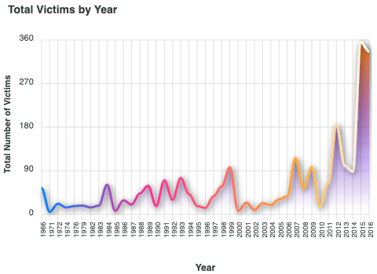
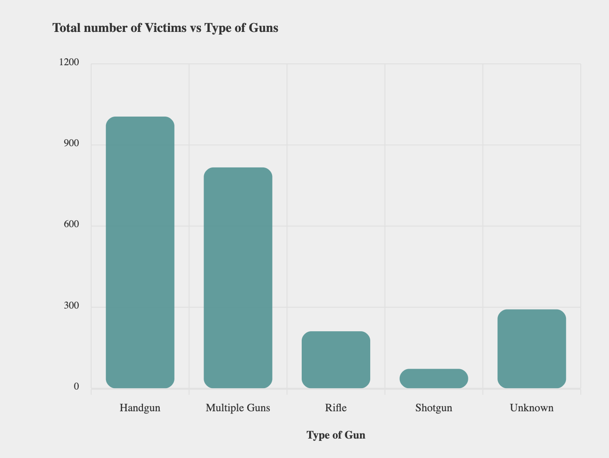
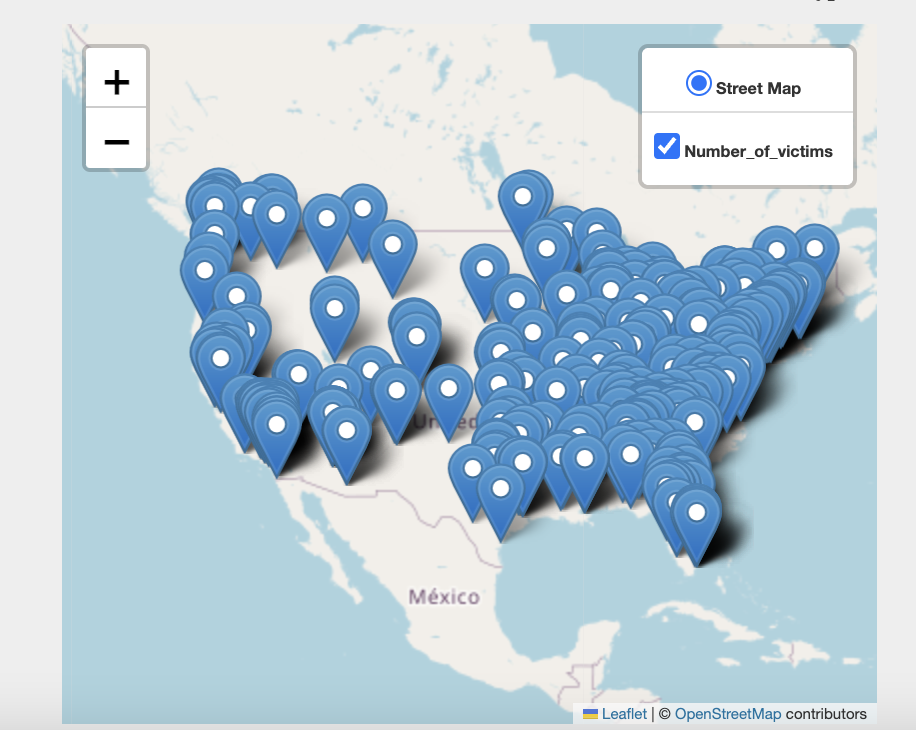
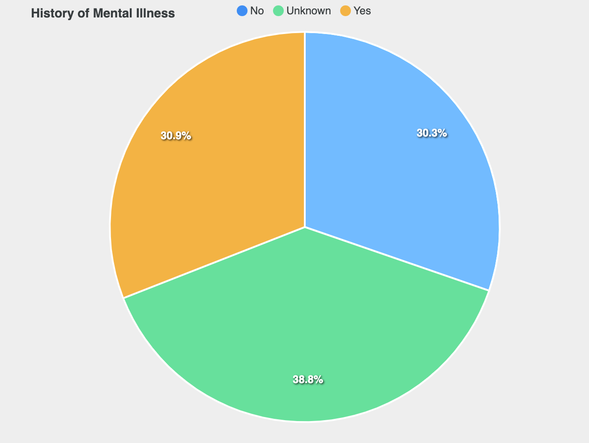

# Mass-Shootings
Project_3_Group_4 : https://maproctor95.github.io/Mass-Shootings/
## Overview of Project
* Data and Delivery (25 points)
    * Data components used in the project are clearly documented. (5 points)
    * The dataset contains at least 100 unique records. (5 points)
    * A database is used to house the data (SQL, MongoDB, SQLite, etc.). (5 points)
    * The project is powered by a Python Flask API and includes HTML/CSS, JavaScript, and the chosen database. (10 points)

* Back End (25 points)
    * The page created to showcase data visualizations runs without error. (7.5 points)
    * A JavaScript library not shown in class is used in the project. (7.5 points)
    * The project conforms to one of the following designs: (10 points)
        * A dashboard page with multiple charts that all reference the same data.

* Visualizations (25 points)
    * A minimum of three unique views present the data. (5 points)
    * Multiple user-driven interactions (such as dropdowns, filters, or a zoom feature) are included on the final page. (5 points)
    * The final page displays visualizations in a clear, digestable manner. (5 points)
    * The data story is easy to interpret for users of all levels. (10 points)

* Group Presentation (25 points)
    * All group members speak during the presentation. (5 points)
    * The content is relevant to the project. (5 points)
    * The presentation maintains audience interest. (5 points)
    * Content, transitions, and conclusions flow smoothly within any time restrictions. (10 points)

### Purpose
   
* There is a huge amount of growth in Mass Shootings across the United States. We decided that it would be important to take a deeper dive into the data surrounding the issue. We will be using data to find similarities within the information provided and use Data Visualizations to show key points that we discover.

## Analysis

* Data and Delivery
    * We used Kaggle data from : https://www.kaggle.com/code/residentmario/exploring-mass-shooting-events/data
    * During the cleaning process we cleaned the data to only show the columns we were going to use for the project and got rid of unneccessary columns. Throughout the cleaning process we ran into issues with data formatting from the original file. Some years were populating wrong and the file was wrapping onto different lines for about 20 of our data points. We solved this by going into the csv file and correcting the formatting issues before uploading in to our database. 
    * Once our data was cleaned we used PgAdmin to create a database with all the data we had cleaned and we used this database to create our python powered flask app to start the visulization process.
* Back End
    * We started by setting up the HTML file and making sure it worked with just the heading and dropdown menu to begin our dashboard. The we began the process of creating our visulizations. Apex charts was a new javascript library for us to use, so it took many hours of errors and research to figure out how to make anything show up on the website.
* Visualizations
    * Our first visulization took a redo of data cleaning to group the data by year and find the sum of the shootings. Once the data was recleaned and ready we began noticing problems with the d3 library we were using to inport the data. To get around that the grouped data was hard coded into the javascript file to create the visual. This visual due to the lack of ways to import of csv files into the javascript code is not able to be interacted with other then a popup for the points of the line.
    
    * The second visualization groups the data by the type of gun that was used in all of the shootings against the total number of victims. Since we had trouble with the d3 library in the first visualization we decided to hardcode this data as well. Since the data was much shorter we were able to make simple edits in the code. We found in the data, after uploading the csv file, that multiple columns for "Multiple Guns" and "Handguns" appeared because of one letter being capitalized. So we were able to just combine the total number of victims for each set and make one column of each.

    * The third visualization was supposed to be a bubble chart however we decided to do a map plot of US and match that with the coordinates of the mass shooting events. For this plot, we used the geoJSON function to parse the data and locate the geographic information. This ran as a loop. We attached a pop up so that when a marker on the map is clicked, it displays the total number of victims information. If there were more time, I would have liked to have done a bubble chart where the radius of the bubble is pegged with another variable.
    
     * The fourth visualization groups the data by the history of mental illness against the total number of cases/shooters. Since we had trouble with the d3 library, we decided to use the appexcharts. First, we manipulated or groupby the data in pandas and after that, we used it for the visualization. we were able to count the cases and shooters based on their mental illness, and finally, visualize the mental illnesses status of all shooters.
        
### Pictures

